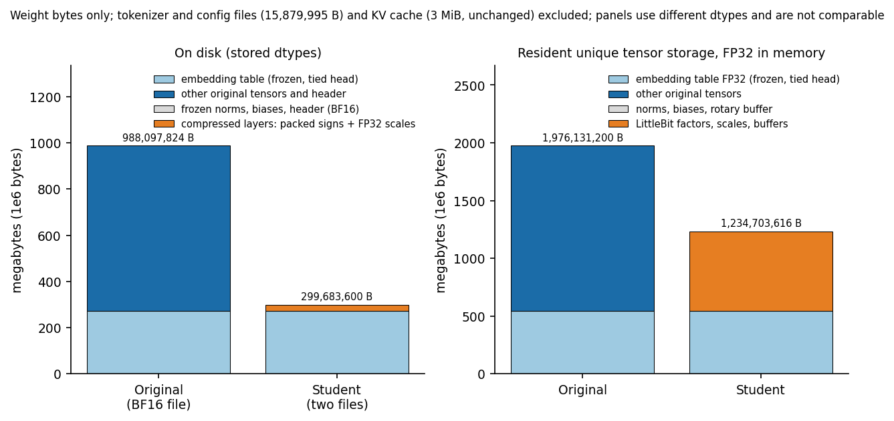
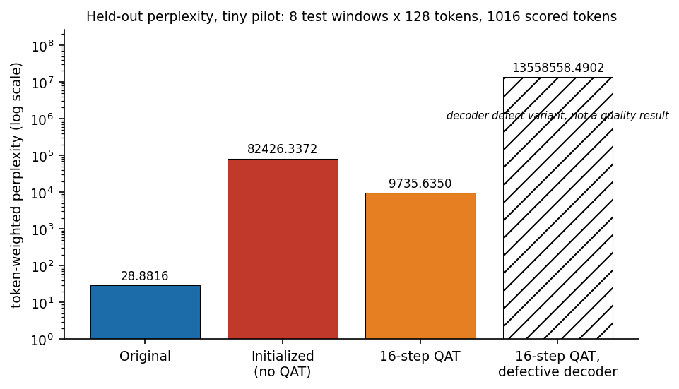
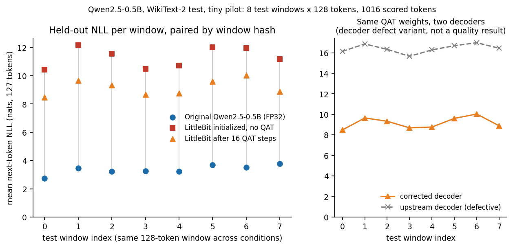
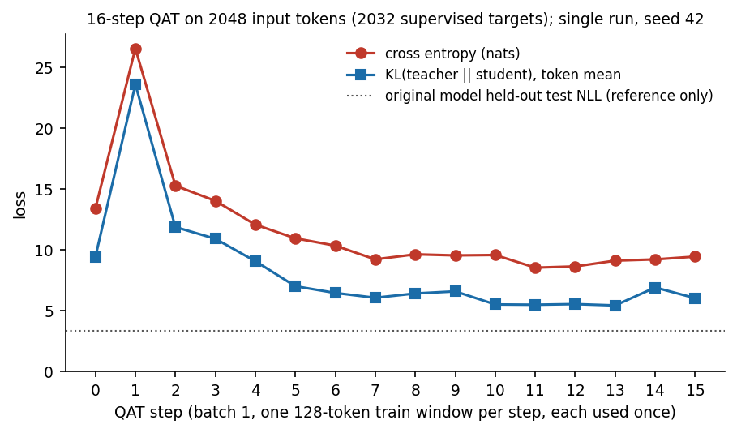

# DRAFT, NOT FOR PUBLICATION: Reading the bits back: a sign-dropping unpacker and the real storage cost of a sub-1-bit quantizer

*Review draft; not published. Two component findings about existing research code, one decoder
defect and one storage accounting gap, plus a tiny wiring pilot that ran the whole path on a real
model. Nothing here is a benchmark, a replication of published results, or a claim about the
quality of the method.*

*Disclosure: the code, tests and this text were drafted with an AI coding assistant (Claude,
Anthropic). The experiments were executed by an automated AI coding workflow on the author's Mac,
not run by hand; the author's review of the outputs is still pending. Every number below comes
from recorded JSON or log files in the repository.*

## What was examined

LittleBit and LittleBit-2 (Lee, Kim, You, Kim; NeurIPS 2025 and ICML 2026) compress language model
weights below one bit per weight by factorizing each matrix into low-rank latent factors,
binarizing those factors, and keeping small scale vectors. The official code
(SamsungLabs/LittleBit, commit 933857e, CC BY-NC 4.0) stores the binary factors packed into
32-bit words when it saves a checkpoint, and unpacks them when it loads one.

This audit asked two deployment questions: does the save and load round trip preserve the signs,
and how many bits does a weight really cost on paper, on disk and in memory? No originality is
claimed. This is a deployment check of existing research code.

## Finding 1: the unpacker drops most -1 signs

The packer is correct. The unpacker reads bit k of each word with

    (word << k) & 1

Shifting left by one or more always clears bit 0, so only the first column of every 32-column word
can come back as -1. Every other -1 comes back as +1. The intended expression is `(word >> k) & 1`.

* An exhaustive sweep of 2,010 sign patterns through the actual upstream functions: 296 decode
  exactly, 21,881 signs flip, all from -1 to +1. A one-line rule (exact if and only if every -1
  sits at a column that is a multiple of 32) predicted every case.
* 72 seeded upstream layers reloaded through an emulation of the packed load path: about half of
  the signs survive and every output changes. With a corrected decoder, all signs survive and the
  float32 outputs are bitwise identical (raw fp32 save profile, 36 of 36).
* A one-line patch (`<<` to `>>`) applied in memory fixes 2,010 of 2,010 cases.
* An official upstream state-dict loading path was also run, on a synthetic single-layer file
  only: sign agreement 0.53 to 0.59 with the shipped decoder, 1.0 and bitwise equal outputs with
  the corrected one. The full-model official loader was not run.

Two easy tests miss this defect: a width-1 matrix and an all +1 matrix both round-trip perfectly.
The smallest failing input is the row `[+1, -1]`. The defect was first seen in an exploratory run,
before the preregistration, so this is a confirmed defect report, not a predicted discovery.

## Finding 2: bits on paper versus bytes on disk versus bytes in memory

At the layer level (formula-level accounting on illustrative shapes):

* The upstream bits-per-weight formula counts one middle scale vector per path, while the module
  stores two.
* Rows of the U factor are padded to 32 bits, so padding is nonzero whenever the split dimension
  is not a multiple of 32.
* When the minimum split dimension floor binds, actual bits per weight exceed the target (a 64x64
  layer at target 0.1 lands at 0.78 plain and 1.56 residual).
* After the packed load, the factors are held at float width: about 16 times (bf16) or 32 times
  (fp32) the packed sign bytes for large layers.

The same gaps show up on a real model, measured in the wiring pilot below:

* For the converted block layers, the upstream formula reports 0.530 bits per weight. Packed
  signs alone are 0.497. The actual compressed checkpoint file, with 32-bit scales, is 0.609.
* On disk, the original model is one 988 MB BF16 file. The pilot stores 272 MB of frozen BF16
  tensors (almost all of it the embedding table) plus 27 MB of compressed layers: about 300 MB in
  total. The embedding table, which LittleBit does not compress, is about 91 percent of that.
* In memory, everything is unpacked to float32: 1.98 GB of unique tensor storage for the original
  model versus 1.23 GB for the compressed one. The latent factors are not held as packed bits.
* The KV cache (3 MiB at 128 tokens) is unchanged.
* Tokenizer and config files are excluded from all of these counts.

Disk and memory numbers use different data types and should not be compared with each other.

## A tiny wiring pilot on a real model

To check that the harness works end to end (conversion, training, packed save, reload, byte
accounting) on a real pretrained model, one very small bounded run was done. It is a wiring check
with a fixed, preregistered budget (QUALITY_PREREGISTRATION.md), far too small to say anything
about the quality of the method.

* Model: Qwen2.5-0.5B (Apache-2.0). This model is smaller than, and outside, the model table in
  the LittleBit papers, so nothing here speaks to the published settings.
* Every linear layer in the 24 transformer blocks converted with the actual upstream module at an
  `eff_bit` target of 0.55, residual path on. Embeddings, tied output head, norms and biases frozen.
* Quantization-aware training: 16 steps, one 128-token WikiText-2 training window per step,
  2,048 input tokens and 2,032 supervised next-token targets in total. Cross entropy plus
  distillation KL against the frozen original model. CPU, float32, one seed.
* Held out: 8 test windows of 128 tokens, 1,016 scored tokens, scored after saving and reloading
  each compressed model.

What the wiring check showed:

* With the corrected decoder, the reloaded model matched the in-memory model: all 171,294,720
  signs, and bitwise identical logits and loss on CPU in float32 on the one 128-token validation
  window that was compared, for both the initialized and the trained checkpoint. No other input
  was compared. The frozen original model was unchanged by training.
* Reloading the same trained weights with the shipped unpacker made all 8 held-out windows worse
  than the corrected reload, which is the decoder defect from Finding 1 showing up on a real
  model.

| Model on the same 1,016 test tokens | Perplexity |
|---|---|
| Original | 28.88 |
| Compressed, initialized, no training | 82,426 |
| Compressed, after 16 training steps | 9,736 |
| Same trained weights, reloaded with the shipped unpacker | 13,558,558 |

The last row is not a quality result. It shows what the unpacker defect does to these weights.

At this budget the compressed model stayed far from the original: training helped relative to the
initialized model in all 8 windows, but perplexity stayed about 337 times that of the original, in
line with the predictions written before the run. With 16 steps on 2,048 tokens, one seed and one
model outside the papers' table, this is not evidence about LittleBit at the budgets, model sizes
or hardware used in the papers.

## What may transfer

* Check packed formats with an exhaustive sign sweep, not with all-positive or width-1 tests.
* Keep advertised bits, file bytes, resident bytes and KV cache apart, and say which dtype each
  one assumes.
* Prove that a packed reload reproduces the in-memory model before reporting any quality or
  speed number, and say on which inputs that was compared.
* Report initialized and trained quality separately, on frozen, hashed windows, paired by window.

## Limits

* Component findings use seeded random-weight layers and illustrative shapes; the layer storage
  numbers are formula level.
* Pilot: one model, one seed, one run, 16 steps, 2,048 training tokens, 1,016 scored tokens. Eight
  contiguous windows are not independent samples; no confidence intervals or tests are reported.
* No validated 4-bit baseline, no smaller same-family model, no task accuracy, no end-to-end
  latency or throughput.
* The training stage peaked at 6.53 GiB of process memory, above the 6 GiB guard threshold. The
  guard samples memory at checkpoints and is not a hard cap, so the run was not stopped.
* The full-model official loader was emulated, not run.
* No further training is planned in this project.

## Code, data and status

The audit code, recorded results and figures are in the public repository
https://github.com/timurista/littlebit-deployment-audit, release v0.1.0
(https://github.com/timurista/littlebit-deployment-audit/releases/tag/v0.1.0; both URLs to be
verified once the release exists). No license is granted for the original code yet; portions
derived from LittleBit remain CC BY-NC 4.0 (LICENSE_NOTES.md, LICENSE_PROPOSAL.md). The patch has
not yet been sent to the maintainers. No license agreement was accepted and no cloud resources
were used.

*Draft status: review draft; not published on Medium.*
